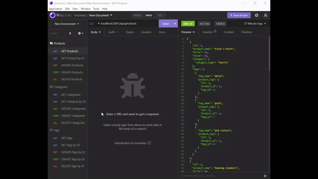

# E-Commerce Back End

## Description

The back end for an e-commerce site by using Express.js API to use Sequelize to interact with a MySQL database.

## Table of Contents
* [User Story](#user-story)
* [Acceptance Criteria](#acceptance-criteria)
* [Installation](#installation)
* [Usage](#usage)
* [Demontration](#demontration)
* [Questions](#questions)


## User Story

```md
AS A manager at an internet retail company
I WANT a back end for my e-commerce website that uses the latest technologies
SO THAT my company can compete with other e-commerce companies
```

## Acceptance Criteria

```md
GIVEN a functional Express.js API
WHEN I add my database name, MySQL username, and MySQL password to an environment variable file
THEN I am able to connect to a database using Sequelize
WHEN I enter schema and seed commands
THEN a development database is created and is seeded with test data
WHEN I enter the command to invoke the application
THEN my server is started and the Sequelize models are synced to the MySQL database
WHEN I open API GET routes in Insomnia for categories, products, or tags
THEN the data for each of these routes is displayed in a formatted JSON
WHEN I test API POST, PUT, and DELETE routes in Insomnia
THEN I am able to successfully create, update, and delete data in my database
```

## Installation

Run the following commands in your terminal.

`npm init`

`npm install mysql2`

`npm install sequelize`

`npm install dotenv`

## Usage 
  
Run the following command at the root of your project and answer the prompted questions:

`mysql -u root -p`

Enter password when promted

`source db/schema.sql`

`quit`

`npm run seed`
  
`npm start`

## Demontration

* The following animation shows the application's GET routes to return all categories, all products, and all tags being tested in Insomnia: Or follow this [walkthrough video](https://drive.google.com/file/d/1KxVXld4-JGkCAKsfrnUcZLCyphhRhnVh/view) 


* The following animation shows the application's GET routes to return a single category, a single product, and a single tag being tested in Insomnia: Or follow this [walkthrough video](https://drive.google.com/file/d/1qhugLdQh8jHtrdXY3cQazW5KijA5pVcV/view)



* The following animation shows the application's POST, PUT, and DELETE routes for categories being tested in Insomnia: Or follow this [walkthrough video](https://drive.google.com/file/d/1W8daVkFFcvzaanmk4vxvDFZwn3MQc6cV/view)


* This [Link](https://watch.screencastify.com/v/1VdCGjF8FqRsQCUoLsap) is a walkthrough video that shows how to install dependencies, to create the schema from the MySQL shell, to seed the database from the command line and to start the application’s server

* This [Link](https://drive.google.com/file/d/1L3jzly7AYhNAe4JLcCsF-RLMMns7g1dC/view) is a walkthrough video that shows application's functionality of the e-commerce back end inluding the GET, POST, PUT, and DELETE routes for categories, products and tags being tested in Insomnia

## Questions
If you have any questions about this projects, please contact me at test@test.com or more projects on [Github](https://github.com/begirlz)